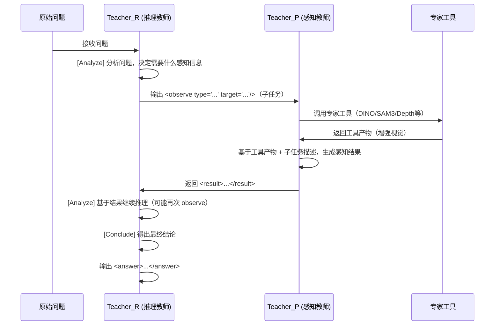

# 0527 进展记录 — Video-OPD 框架设计调整

## 一、潜空间推理框架（参考 Coconut / MCOUT）

### 1.1 参考论文

- **Coconut** (Meta FAIR, 2024.12): "Training Large Language Models to Reason in a Continuous Latent Space"
  - 核心思想：用 LLM 最后一层 hidden state 作为"连续思维"（continuous thought），不解码为 token，直接作为下一步输入的 embedding
  - 用 `<bot>` / `<eot>` 标记连续思维区域
  - 连续思维部分**不参与 CE loss 计算**
  - 训练方式：分阶段逐步将显式推理步骤替换为 continuous thought token

- **MCOUT** (2025): "Multimodal Chain of Continuous Thought for Latent-Space Reasoning in Vision-Language Models"
  - 将 Coconut 扩展到多模态：在联合潜在空间中直接推理
  - MCOUT-Base：重用 VLM 最后一个 hidden state 作为连续思维进行迭代推理
  - MCOUT-Multi：集成多模态潜在注意力机制，增强视觉-文本跨模态对齐

### 1.2 我们的设计（Video-OPD）

```
┌─────────────────────────────────────────────────────────────────┐
│  学生模型 (Qwen3-VL-4B-Instruct)                                │
│                                                                  │
│  输入: 视频 + 问题文本                                            │
│                                                                  │
│  内部过程:                                                        │
│    1. 视觉编码器处理视频 → 视觉 token 序列                        │
│    2. 文本编码器处理问题 → 文本 token 序列                         │
│    3. 模型在潜空间中进行推理（连续思维）                           │
│    4. 推理过程中产生 <observe> 调用（子任务/工具调用）              │
│    5. 最终输出解码为文本: <think>...<observe>...<result>...</think> │
│       + <answer>                                                  │
│                                                                  │
│  关键: 学生的"推理过程"发生在潜空间中，                           │
│        但最终输出（包括 observe 和 answer）仍解码为文本             │
│        以便与教师对齐、监督、验证                                  │
└─────────────────────────────────────────────────────────────────┘
```

**与 Coconut/MCOUT 的关系**：
- Coconut 的 continuous thought 完全不解码 → 我们的学生模型在**推理中间状态**也可以不解码（潜空间特征 z），但**最终输出**必须解码为文本（因为需要与教师对齐、需要验证）
- 训练时：SFT 阶段先用完整文本轨迹训练，OPD 阶段逐步让模型学会在潜空间中更高效地推理
- 推理时：模型输出的 `<observe>` 触发工具调用，工具结果注入后继续推理

**不严谨的"编解码"说法修正**：
- ❌ 错误说法："学生输出潜空间特征，由冻结的 Qwen3-VL 解码成文本"
- ✅ 正确说法：学生模型（Qwen3-VL-4B）在推理过程中，中间状态以潜空间特征形式存在（类似 Coconut 的 continuous thought），最终自回归解码为文本输出。SFT 和 OPD 都监督这个文本输出。潜空间的优势在于：推理过程不受语言空间限制，可以更高效地处理视觉-空间信息。

---

## 二、数据集与工具对应关系（修正版）

### 2.1 工具→数据集映射

| 工具 | 数据集 | 用途 |
|------|--------|------|
| A-1 temporal_locate | Charades-STA + DiDeMo | 时间定位 |
| A-2 temporal_clip | **Charades-STA + DiDeMo** | 时间段描述（泛化能力） |
| A-3 spatial_detect | **VIPSeg**（主力）+ HC-STVG（补充） | 空间定位 |
| A-4 spatial_crop | **VIPSeg**（主力）+ HC-STVG（补充） | 区域描述 |
| A-5 tracking_overlay | **VIPSeg**（跨帧追踪）+ HC-STVG（人的轨迹） | 运动轨迹描述 |
| A-6 depth_overlay | VIPSeg | 深度/空间关系 |
| A-7 ocr_zoom | TextVR | 文字识别 |
| A-8 raw_videoqa | NExT-QA + STAR + CLEVRER | 原始视频问答（B类） |

### 2.2 数据集→用途映射（数据集为第一列）

| 数据集 | train.jsonl 条数 | 视频数 | 用于哪些工具/任务 | 状态 |
|--------|:---:|:---:|------|:---:|
| **Charades-STA** | 12408 | 9848 | A-1 temporal_locate, A-2 temporal_clip | ✅ |
| **DiDeMo** | ~33000 | 7585(train) | A-1 temporal_locate, A-2 temporal_clip | ✅ 修复中 |
| **VIPSeg** | 13993 | 2806 | A-3 spatial_detect, A-4 spatial_crop, A-5 tracking, A-6 depth | ✅ |
| **HC-STVG v2** | 待解压 | ~16000 | A-3 spatial_detect, A-4 spatial_crop, A-5 tracking（补充） | ⏳ |
| **TextVR** | ~10596 | 10596 | A-7 ocr_zoom | ✅ |
| **NExT-QA** | 23085 | 1570 | A-8 raw_videoqa（因果/时序推理） | ✅ |
| **STAR** | 45731 | 复用Charades | A-8 raw_videoqa（情境推理） | ✅ |
| **CLEVRER** | 152572 | 10000 | A-8 raw_videoqa（合成因果/反事实） | ✅ |

**A-2 说明**：
- Charades-STA + DiDeMo 的标注片段做时间段描述
  - Charades-STA：每条标注有 query（如 "person opens a door"）+ 时间段 → 可反向作为 temporal_clip 的 gt_caption
  - DiDeMo：每条标注有 query + 时间段 → 同理
- A-2 覆盖：日常活动（Charades）+ 户外/多样场景（DiDeMo）

**A-8 raw_videoqa 说明**：
- 这是 B 类数据，不对应特定工具，而是直接的视频问答
- NExT-QA：因果推理（"why did X happen?"）、时序推理（"what happened before/after?"）
- STAR：情境推理（多选题，复用 Charades 视频）
- CLEVRER：合成场景的因果/反事实推理（"what if the red ball didn't collide?"）
- 这些数据用于 SFT 阶段训练模型的基础视频理解能力，OPD 阶段作为 verifiable 样本（多选题可机械验证）

---

## 三、Verifiable 工具的验证方式

| 工具 | verifiable | 验证方式 | 具体实现 |
|------|:---:|---------|---------|
| temporal_locate | ✅ | **IoU 阈值** | 预测 [t1,t2] 与 GT [gt1,gt2] 计算时间 IoU，阈值 ≥ 0.5 判正确 |
| spatial_detect | ✅ | **IoU 阈值** | 预测 bbox 与 GT bbox 计算空间 IoU，阈值 ≥ 0.5 判正确 |
| ocr_zoom | ✅ | **字符串匹配** | 预测文本与 GT 文本做归一化后精确匹配（忽略大小写/标点） |
| depth_overlay | ✅ | **选择题判断** | 转为二选一："A closer" or "B closer"，精确匹配答案 |
| temporal_clip | ❌ | — | 描述性输出，无法机械验证 |
| spatial_crop | ❌ | — | 描述性输出，无法机械验证 |
| tracking_overlay | ❌ | — | 描述性输出，无法机械验证 |

**depth_overlay 的选择题设计**：
- 问题固定为二选一格式："Which is closer to the camera, A or B?"
- GT answer 固定为 "A is closer" 或 "B is closer"
- 验证时只需检查学生答案中包含哪个选项
- 后续可扩展为：朝向判断（"facing left/right"）、相对位置（"A is to the left of B"）

---

## 四、帧指定方式与 Qwen3-VL 时间戳机制

### 4.1 Qwen3-VL 的时间戳对齐技术

Qwen3-VL 内置**文本时间戳对齐机制**：
- 每个文本 token 可关联到特定视频帧区间
- 支持亚秒级精度（实测 ±0.12s）
- 双向注意力：文本→视频 和 视频→文本 的双向时序校准
- 模型**天然知道视频总时长和帧采样率**（通过视觉编码器的时序位置编码）

### 4.2 我们的帧指定设计

**原则：学生模型只接受视频（不接受单帧图片），所有帧指定通过时间戳完成。**

```
问题格式: "At 3.2s, where is the red cup in the frame?"
         "At 5.7s, what text is written in the region [120,80,200,160]?"
         "At 2.0s, which is closer to the camera, A or B?"

observe 格式: <observe type="spatial_detect" frame="3.2" target="red cup"/>
             <observe type="ocr_zoom" frame="5.7" bbox="[120,80,200,160]" target="text"/>
             <observe type="depth_overlay" frame="2.0" objects="[120,80,200,160],[450,200,550,320]" target="depth relation"/>
```

**为什么用时间戳而非帧编号**：
1. Qwen3-VL 原生支持时间戳对齐，模型内部自动将时间戳映射到对应帧
2. 时间戳对用户/模型更直观（"3.2秒"比"第96帧"更自然）
3. 不依赖采样率（不同视频 fps 不同，时间戳是统一的）
4. 模型通过视觉编码器的时序位置编码天然知道视频总时长

**模型如何知道视频信息**：
- Qwen3-VL 的视觉编码器在处理视频时，会生成带时序位置编码的视觉 token
- 模型在 prompt 中不需要显式告知总时长/采样率
- 模型通过注意力机制自动感知视频的时间范围

---

## 五、工具联动与复杂组合设计

### 5.1 单工具调用（当前 SFT 阶段）

当前设计每个训练样本只包含**一次工具调用**，目的是让模型学会每种工具的基本用法。

### 5.2 多工具联动（OPD 阶段自然扩展）

推理教师（Teacher_R）在 OPD 阶段可以输出多次 observe，形成工具链：

```
示例：复杂问题 "What is the person doing after they pick up the red cup?"

Teacher_R 的推理过程：
<think>
[Analyze] Need to first locate when the person picks up the red cup,
          then describe what happens after.

<observe type="temporal_locate" target="person picks up the red cup"/>
<result>It happens from 3.2s to 5.1s.</result>

[Analyze] Now need to describe what happens after 5.1s.
<observe type="temporal_clip" time="5.1-8.0" target="person's activity after picking up cup"/>
<result>The person walks to the table and places the cup down.</result>

[Conclude] After picking up the red cup, the person walks to the table and places it down.
</think>
<answer>After picking up the red cup, the person walks to the table and places it down.</answer>
```

### 5.3 时间-空间联动

```
示例："Where is the red cup at the moment the person starts eating?"

<think>
[Analyze] First locate when the person starts eating.
<observe type="temporal_locate" target="person starts eating"/>
<result>It happens from 12.3s to 12.3s.</result>

[Analyze] Now detect the red cup's position at 12.3s.
<observe type="spatial_detect" frame="12.3" target="red cup"/>
<result>The red cup is located at [340,180,420,260].</result>

[Conclude] At the moment the person starts eating (12.3s), the red cup is at [340,180,420,260].
</think>
<answer>At 12.3s when the person starts eating, the red cup is at [340,180,420,260], on the right side of the table.</answer>
```

### 5.4 当前 SFT 数据只支持单次调用的原因

- SFT 阶段目标：让模型学会**每种工具的格式和基本能力**
- OPD 阶段：推理教师自然地输出多次 observe → 学生模仿 → 学会组合
- 这样设计的好处：**不需要人工标注复杂组合数据**，推理教师自己会组合

---

## 六、教师设计（修正版）

### 6.1 感知教师 Teacher_P

**核心职责**：接收学生提出的子任务（observe），执行工具，返回感知结果。

**Teacher_P 接收的输入**：

| 工具 | Teacher_P 接收的输入 | 说明 |
|------|---------------------|------|
| A-1 temporal_locate | 视频 + "Locate when: {target}" | 教师看完整视频，定位时间段 |
| A-2 temporal_clip | 视频片段 [t1,t2] + "Describe what happens" | 教师看裁剪片段，描述内容 |
| A-3 spatial_detect | 视频帧@t + "Locate: {target}" | 教师看指定帧，定位物体 |
| A-4 spatial_crop | 帧裁剪区域（bbox 放大图）+ "Describe this region" | 教师看放大区域，描述内容 |
| A-5 tracking_overlay | SAM3+DINO 高亮轨迹视频 + "Describe trajectory of: {target}" | 教师看高亮视频，描述运动 |
| A-6 depth_overlay | Depth Anything V2 深度图 + 两物体标注 + "Which is closer: A or B?" | 教师看深度图，判断远近 |
| A-7 ocr_zoom | 帧裁剪区域（bbox 高分辨率放大）+ "Read the text" | 教师看放大区域，读文字 |

**关键设计原则**：
1. Teacher_P **接收学生提出的子任务问题**（即 observe 中的 target）
2. Teacher_P 的回答**就是学生要学会说的 `<result>` 内容**
3. **无信息泄露**：Teacher_P 不看原始问题的完整上下文，只看子任务
4. Teacher_P 的输入 = 工具产物（视觉）+ 子任务描述（文本）

**如何让 Teacher_P 表现更好**：
1. **提供视觉提示**：不是给原始帧，而是给**工具处理后的增强视觉输入**
   - spatial_detect：Grounding-DINO 的候选框叠加在帧上
   - depth_overlay：Depth Anything V2 的彩色深度图 + bbox 标注
   - tracking_overlay：SAM3 的 mask 轨迹叠加在视频上
   - ocr_zoom：高分辨率裁剪（2x-4x 放大）
2. **精确的子任务描述**：不是模糊的"描述这个区域"，而是具体的"Locate the red cup in this frame"
3. **多模态输入**：同时给视觉（增强图/视频）+ 文本（子任务描述）

### 6.2 推理教师 Teacher_R

**核心职责**：拿到问题后进行推理，输出工具调用（observe），等待 Teacher_P 返回结果，继续推理。

**Teacher_R 的完整工作流**：



**关键设计**：
- Teacher_R 输出的 observe **同时指导工具调用和给 Teacher_P 提问**
- Teacher_R 拿到的 result **就是 Teacher_P 的输出**（不确定对不对，但教师直接拿过来）
- 允许多次 observe（当前数据只支持一次，但框架设计支持多次）
- 推理教师教推理，感知教师教感知，**两者解耦**

**确保无信息泄露**：
- Teacher_P 只看子任务描述 + 工具产物，**不看原始问题**
- Teacher_P 的输出是对视觉内容的客观描述，不包含推理结论
- Teacher_R 的推理链是基于 result 的逻辑推导，不依赖视觉细节
- 学生最终学会的是：**自己提出子任务 → 自己感知 → 自己推理**

### 6.3 学生学到什么

```
学生的完整输出（SFT 监督目标）：
<think>
[Analyze] {推理教师教的：如何分析问题、决定调用什么工具}
<observe type="..." frame="..." target="..."/>  {推理教师教的：如何提出子任务}
<result>{感知教师教的：如何描述感知结果}</result>  
[Conclude] {推理教师教的：如何基于结果得出结论}
</think>
<answer>{最终答案}</answer>
```

- `[Analyze]` + `<observe>` + `[Conclude]` + `<answer>` → 来自 Teacher_R
- `<result>` → 来自 Teacher_P
- 学生在潜空间中同时学会推理和感知，但训练信号是解耦的

---

## 七、SFT 数据生成流程（完整 Pipeline）

### 7.1 对于每条训练样本的生成流程

```
1. 从数据集标注中提取原始信息
   例：Charades-STA → {video, query="person opens door", start=3.2, end=5.1}

2. 生成问题（question）
   "At what time in the video does 'person opens door' happen?"

3. 确定工具调用（observe）
   <observe type="temporal_locate" target="person opens door"/>

4. 运行专家工具，生成工具产物（给 Teacher_P 的视觉输入）
   → 对于 temporal_locate：整段视频 + 子任务 "Locate when: person opens door"

5. Teacher_P 接收工具产物 + 子任务，生成 result
   → "It happens from 3.2s to 5.1s."
   （对于 verifiable 工具，直接用 GT 标注作为 result，不需要真跑 Teacher_P）

6. Teacher_R 接收问题 + result，生成推理链
   → "[Analyze] Need to localize... [Conclude] Time span confirmed."
   （对于模板化的简单任务，直接用规则模板生成，不需要真跑 Teacher_R）

7. 组装完整 trajectory
```

### 7.2 什么时候需要真跑教师模型？

| 场景 | 是否需要真跑教师 | 原因 |
|------|:---:|------|
| SFT 模板数据（A类） | ❌ | GT 标注 + 规则模板即可 |
| SFT 增强数据（C类） | ✅ | Qwen3-32B 生成多样化问题和推理链 |
| OPD 阶段 | ✅ | 需要 Teacher_R 生成多步推理链，Teacher_P 生成感知描述 |
| 可视化验证 | ✅ | 需要真跑 Teacher_P 看它实际输出什么 |

---

## 八、可视化验证计划

### 8.1 需要可视化的内容

对于每种工具，需要展示：
1. **学生看到的输入**：原始视频 + 问题文本
2. **observe 触发后，工具产物**：专家模型的输出（增强视觉）
3. **Teacher_P 看到的输入**：工具产物 + 子任务文本
4. **Teacher_P 的输出**：感知描述文本

### 8.2 可视化顺序

**必须先完成 SFT 数据标注生成**，才能做可视化。因为可视化展示的是：
1. 问题如何设计
2. observe 如何触发工具
3. 工具产物是什么样的视觉内容
4. Teacher_P 接收什么输入、输出什么文本

### 8.3 具体计划

等 HC-STVG / VIPSeg 下载完成后：
1. 先跑 `build_all_jsonl.py` 生成各数据集的 train.jsonl
2. 跑 `stage1_sft_template.py` 生成 SFT 模板数据
3. 写 `tools/visualize_teacher_input.py`：
   - 对每种工具抽取 3-5 个样本
   - 展示完整的 pipeline：问题 → observe → 工具产物 → Teacher_P 输入 → Teacher_P 输出
   - 保存为图片 + 文本对照，供用户检查

---

## 九、当前状态与下一步

### 已完成
- [x] 7 个数据集完整可用（Charades-STA, DiDeMo, CLEVRER, TextVR, STAR, NExT-QA, **VIPSeg**）
- [x] 7 个专家模型全部就绪
- [x] SFT 模板代码框架（stage1_sft_template.py）
- [x] 路径配置系统（paths.py + paths.yaml）
- [x] VIPSeg 帧→视频转换完成（2806 个 2fps mp4）
- [x] YouCook2 彻底否定移除
- [x] A-2 temporal_clip 已改为使用 Charades-STA + DiDeMo
- [x] A-3/A-4/A-5 已改为 VIPSeg 主力 + HC-STVG 补充（HC-STVG 不可用时优雅跳过）
- [x] A-8 raw_videoqa：NExT-QA(23085条) + STAR(45731条) + CLEVRER(152572条) 全部就绪
- [x] DiDeMo build 修复：使用 raw_data/didemo_train.json（有 times 字段）+ 正确映射 .mp4 路径
- [x] build_all_jsonl.py 支持 --force 强制重新生成 + 纳入 nextqa/clevrer 验证

### 进行中（用户在做）
- [ ] HC-STVG v2 解压（延后 2h 处理）

### 待做（当前可立即推进）
- [x] 运行 `build_all_jsonl.py vipseg` 生成 VIPSeg 的 train.jsonl ✅
- [x] 运行 `build_all_jsonl.py charades_sta didemo` 生成对应 train.jsonl ✅
- [x] 写 tools/visualize_teacher_input.py：可视化 pipeline ✅（轻量级，不加载 GPU 模型）
- [x] SFT 模板数据全部生成（36,852 条）并合并 ✅
- [x] 运行可视化脚本，逐个检查每种工具的 Teacher_P 输入输出 ✅（bbox 定位待后续修正）
- [x] 写 tools/run_expert_models.py：批量跑 Depth Anything V2 预计算深度 ✅
- [x] 运行 run_expert_models.py --task depth_a6 替换 A-6 占位答案 ✅（8卡并行，2000条全部成功，翻转率87.5%）
- [x] 重新 merge 合并文件（含真实深度 gt_answer）✅
- [x] 修正训练架构：SFT 需训练三个模型（学生+Teacher_R+Teacher_P）✅
  - 创建 data_preparation/prepare_teacher_sft_data.py 为教师生成专属数据
  - 重写 training/stage1_sft_train.py 支持 --role student/teacher_r/teacher_p
  - 重写 scripts/run_stage1_sft_train.sh 支持 ROLE 环境变量
- [x] 修正学生 SFT：加入 Coconut 式潜空间训练（Decoder LM head）✅
  - 学生在 <think>...</think> 区域内的 hidden states 由冻结 Decoder LM head 解码为 logits
  - Decoder = 学生初始权重的 LM head 冻结副本（仅一个线性层，显存开销极小）
  - 支持 --latent_warmup_steps：前 N 步标准 CE（学格式），之后切换到潜空间训练
  - <think> 区域外（如 <answer>）仍用学生自己的 LM head
  - 教师 SFT 仍是标准 CE（教师不需要潜空间推理）
- [x] 修正 Teacher_R SFT 数据：去掉 <result>...</result> 内容，替换为 <result/> 占位符 ✅
  - Teacher_R 只学推理段：[Analyze] + <observe/> + [Conclude] + <answer>
  - 感知内容（<result> 的具体文本）由 Teacher_P 负责，Teacher_R 不学
- [x] 修正 OPD 训练逻辑 ✅
  - 学生在 OPD 阶段和 SFT 完全一样（潜空间前向），唯一区别是 loss 从 GT→教师 KL
  - Teacher_R 接收学生完整 trajectory（含 Teacher_P 的 result），对推理段逐 token 提供 logits
  - Teacher_P 接收视觉聚焦输入 + 感知问题，对感知段逐 token 提供 logits
  - OPD shell 脚本更新：分别指定 --teacher_r_path 和 --teacher_p_path
- [x] 修正 OPD 感知段解析：从学生 observe 指令中精确解析（正则，非 LLM）✅
  - 新增 ObserveParseError 异常类 + parse_student_observe_strict() 精确解析函数
  - 验证 observe 的 type 是否在已知列表中，验证必需参数是否齐全
  - 解析失败 → 感知段 KL 跳过（不参与梯度），推理段 KL 仍然有效（可更新梯度）
  - pipeline 执行失败也视为解析失败，同样跳过感知段
- [ ] 运行 prepare_teacher_sft_data.py 生成教师 SFT 数据
- [ ] 训练学生:    ROLE=student bash scripts/run_stage1_sft_train.sh
- [ ] 训练Teacher_R: ROLE=teacher_r bash scripts/run_stage1_sft_train.sh
- [ ] 训练Teacher_P: ROLE=teacher_p bash scripts/run_stage1_sft_train.sh
- [ ] 真跑 Teacher_P 验证输出质量
- [x] OPD 阶段：设计多步推理的训练数据生成方案 ✅（data_preparation/stage2_multistep_gen.py）
- [ ] 运行 stage2_multistep_gen.py --mode rule 生成规则组合数据
- [ ] 运行 stage2_multistep_gen.py --mode llm 生成 LLM 多步推理数据（需 Qwen3-32B）
- [ ] 运行 stage2_multistep_gen.py --mode merge 合并 Stage1+Stage2 数据
